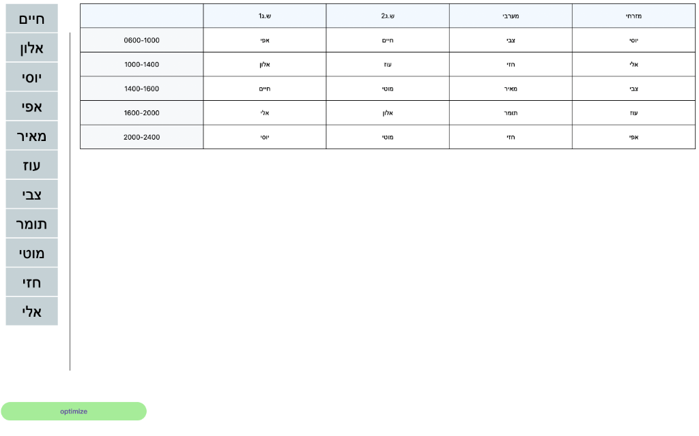
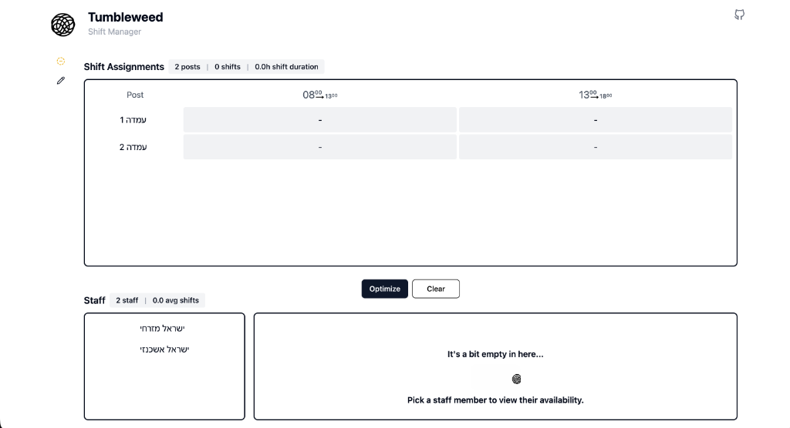

# Tumbleweed

A browser-only staff shift management tool. Try it out at [gor84.com/tumbleweed](https://gor84.com/tumbleweed).

## The Story

I’ve always wanted to find a practical, efficient way to manage staff shifts while juggling complex constraints. This project allowed me to combine that goal with my academic interest in the Simplex algorithm.

Using AI tools to speed up the process, I started exploring Python packages. It took about a week to model the problem effectively, and the results were surprisingly simple and powerful. However, I wanted to challenge myself further by making it a browser-only tool with no backend dependencies. I switched to `highs.js` to handle the heavy lifting directly in the client. I'm currently still on a quest to build the best possible UX for it!

## Project Structure

This repository contains the evolution of the project from a Python prototype to a full client-side application.

- **`web-client/`**: The current, production-ready REACT application. It uses `highs.js` (WebAssembly) to solve the shift scheduling optimization problem entirely in the browser.
- **`shift-optimizer-service/`**: The original Python-based service I built to model the problem. It contains the initial Simplex modeling logic.
- **`client/`**: An earlier iteration of the frontend (React Native).

## Screenshots

### Initial Prototype

### Current Web App

## Tech Stack

- **Core**: React, TypeScript, Vite
- **State Management**: Recoil
- **Styling**: Tailwind CSS, shadcn/ui
- **Optimization**: Highs.js (WebAssembly)
- **Icons**: Tabler Icons
- **Testing**: Playwright, Jest
